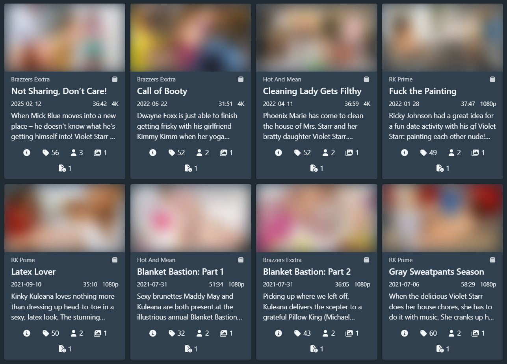
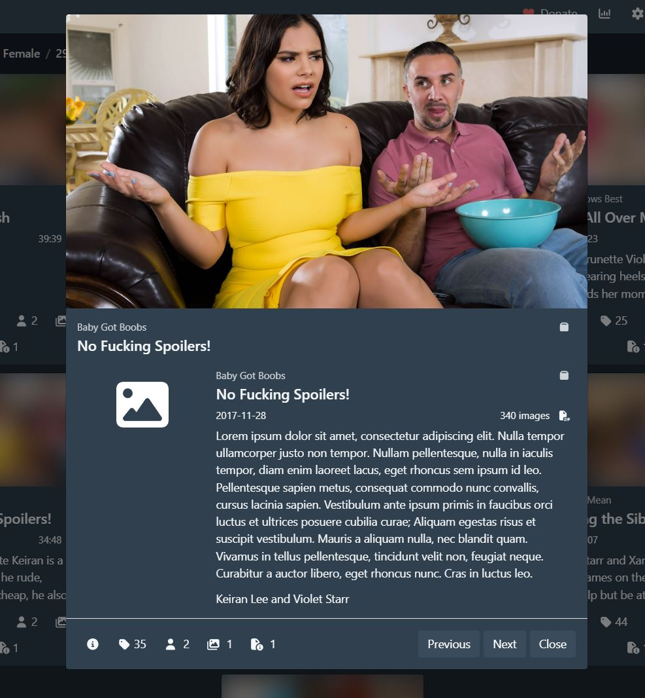

# Valkyr UI

Valkyr UI is a user interface plugin for [Stash](https://github.com/stashapp/stash/) featuring modifications and additions to a variety of components. It is highly customisable, with an in-depth configuration menu that allows you to use just the parts you want.

## Installation

|                      |                |                                                                   |
| -------------------- | -------------- | ----------------------------------------------------------------- |
| :placard:            | **Summary**    | A modular, customisable redesign of the Stash user interface.     |
| :link:               | **Repository** | https://github.com/Valkyr-JS/valkyr-ui                            |
| :information_source: | **Source URL** | https://valkyr-js.github.io/stash-plugins/index.yml               |
| :open_book:          | **Install**    | [How to install a plugin](https://discourse.stashapp.cc/t/-/1015) |

## Features

- Customisable scene cards and gallery cards, with more card types to follow.
- Card data can be customised to be visible from a certain zoom level and up, allowing you to display essential data at low zoom and more data at higher zoom levels.
- Cards can be expanded into modal popups to provide more information without leaving the page.
- An accessible color palette for modified components.
- A dedicated configuration page.

## Requirements

To use this plugin you must be running Stash version 0.31.0 or higher. No other dependencies are required.

## Installation

1. In Stash go to Settings > Plugins.
2. Under _Available Plugins_ click the _Add source_ button.
3. Fill out the fields in the popup form. The Name and Local Path fields can be whatever you like, but the Source URL needs to match the URL below. I recommend the following;
   - Name: Valkyr-JS
   - Source URL: https://valkyr-js.github.io/stash-plugins/index.yml
   - Local path: Valkyr-JS
4. Click confirm and you should see a new line under _Available Plugins_ called "Valkyr-JS" (or whatever you entered for Name in the popup). Click this and you'll see my available plugins.
5. Check the _Valkyr UI_ checkbox and click Install in the top right of _Avaialable Plugins_.
6. Go to the scenes page or home page and you should see the cards styled differently. You may need to refresh the page to see the changes.

## Configuration

The plugin configuration is found at `/plugins/valkyr-ui`. For example, if your Stash is hosted at `http://localhost:9999`, you will find the configuration page at `http://localhost:9999/plugins/valkyr-ui`.

Changes are saved immediately, however please note that you may need to refresh the page before you are able to see the changes in the app. This is due to how Stash caches data.

## Screenshots

## Feedback

Please raise bugs [via GitHub](https://github.com/Valkyr-JS/valkyr-ui/issues). If you have any questions, requests, or any other kind of feedback, please leave a comment on the thread on the [Stash Discourse](https://discourse.stashapp.cc/c/plugins/18/none).
